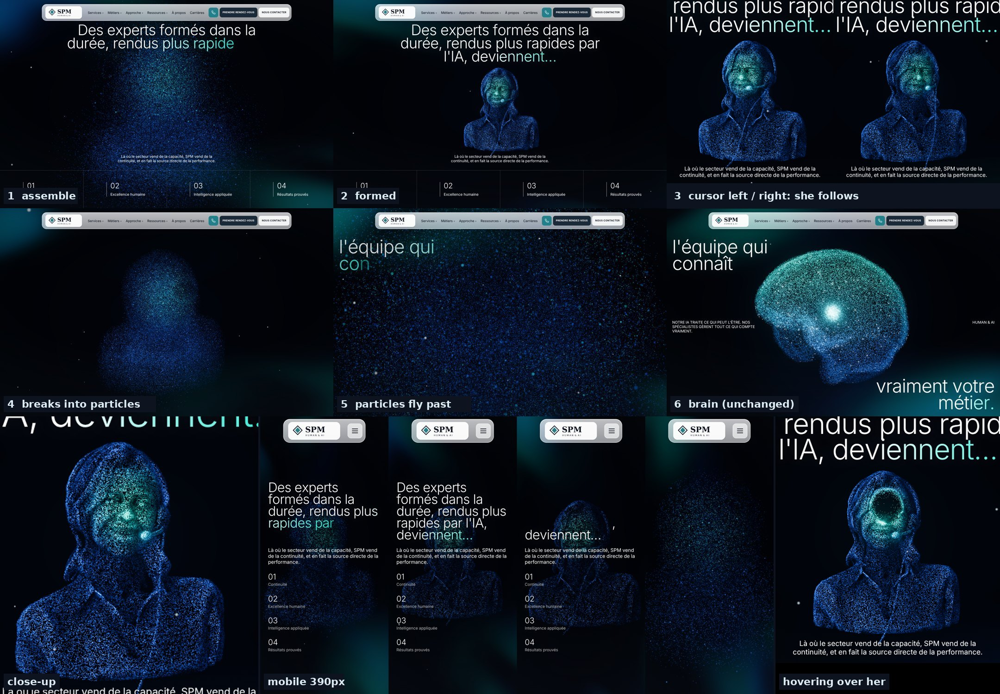

# Home Lab hero: woman with headset in the galaxy slot

**Status: v2 written to the Instatic draft (bigger bust, brain-like density and flow, the galaxy colours on exit). Not yet published.** The live site runs v1 (sha256 `7bbbe4e7…`). The version before the woman is saved in `../rollback-2026-10-07/`.

`preview-hover.mp4` shows the mouse interaction. It was recorded with software rendering, so it is choppier than on a real GPU.

## What changes

The 2nd hero object (the galaxy) becomes a particle bust of a woman wearing a headset. The source model is `assets/3d/woman-headset.glb` (Meshy).

Kept exactly as the galaxy had them:
- **Entry:** the points start as the same scattered cloud and assemble in, with the same delays and easing.
- **Exit:** she breaks into particles that fly outward and past the camera, using the same `uBlow` maths and timing, into the brain.
- **Colours:** same palette, steel blue edges (`#3A6FD0`) and turquoise core (`#45D6C4`).
- **Point style:** same additive round points, the 2% larger "star" points, and the same bloom.
- **Mouse reaction, camera:** the view orbits toward the cursor, with the same parallax as the galaxy.
- **Mouse reaction, hovering over her:** the galaxy's push. Particles under the cursor part into a glowing ring and flow back when it moves on. A soft mask of her silhouette, built at load from her own points, switches it on only over her. The push sits on the plane of her front surface, scaled to her size so she stays recognisable (`pointerRadius` 2.0, `pointerStrength` 1.0; the galaxy-size ring is 3.2 / 2.0).
- **Mouse reaction, not hovering:** she moves slightly with the cursor (a turn, a small lift and a drift) on critically damped springs, so it eases in and settles. She calms down while the cursor is over her. Before the mouse first moves she only sways slowly, so there is never a hole in her face on load.

Adapted for a person:
- The disc spin becomes a slow idle sway.
- The camera dive is shorter (48 → 34 instead of 48 → 18), so the bust stays between the headline and the paragraph.
- During the break-up her face drifts to the centre as the camera pushes in.

So the face reads at hero size:
- The face gets a finer share of the triangle budget.
- Hidden layers (the back of the head, inner hair) are dimmed while she is formed, using a baked front-visibility value per triangle. As she scatters they return to full brightness, so the exit looks exactly like the galaxy's.
- Ridges and creases (curvature) get extra points, and their shading picks out the eyes, smile, collar and headset.
- Point size follows screen density.

## Weight and performance

| Item | Value |
|---|---|
| `hlab-hero-vesper.js` | 232,283 characters (was 111,070); the baked bust adds about 112K as base64 |
| Points, desktop above 1440 px | ~217k |
| Points, 1025–1440 px | ~140k |
| Points, 641–1024 px | ~81k |
| Points, phone | ~39k (no bloom, no mouse reaction, as before) |

Instatic stores every `hlab-*` file as "all pages", because the MCP ignores `runtime.scope`. So other pages download this script too, even though it does nothing there. To fix that, set the scope of the `hlab-*` files to the Home Lab page in the Instatic editor.

## Files

| File | What it is |
|---|---|
| `hlab-hero-vesper.js` | The built candidate (sha256 `50c5c79efe82677e9abd3a3a0455f243ad8da8a9d35a24c29759cf6b7ebf0ed8`). |
| `galaxy-woman.js` | The replacement `Galaxy` module plus `buildWomanGeometry`. |
| `config.json` | `WOMAN_CONFIG` values (size, light, shading, density, hover push, follow, springs, camera dive). |
| `woman-headset.vbrn` | Baked bust, VBRN container (same format as the brain). Holds 8k triangles (4k on the face), then `VIS1` with one visibility byte per triangle, then `CRV1` with one int8 curvature value per vertex. |
| `build.py` | Rebuilds `hlab-hero-vesper.js` from the rollback base and the files above. |
| `bake/` | Rebuilds `woman-headset.vbrn` from the GLB: in `bake/`, run `npm i meshoptimizer@1.3.0`, then `FACE=4000 node bake.mjs ../../../../assets/3d/woman-headset.glb . 8000` (simplify), `python3 -I vis.py woman-8000f4000.vbrn v.vbrn` (front visibility), `python3 -I curv.py v.vbrn ../woman-headset.vbrn` (curvature). |

## Apply (only after approval)

1. Run `python3 -I build.py`.
2. Write `hlab-hero-vesper.js` to `src/scripts/hlab-hero-vesper.js`. Instatic fileId is `5j7w7asqp7TWKHN300Frq`. Write it in ~35K chunks with the `/*__HLAB_CONT__*/` marker, then check that the stored hash equals the sha256 above.
3. Publish only when asked.

**Rollback:** write `../rollback-2026-10-07/scripts/hlab-hero-vesper.js` back (sha256 `07c8d37b…`), then publish.
