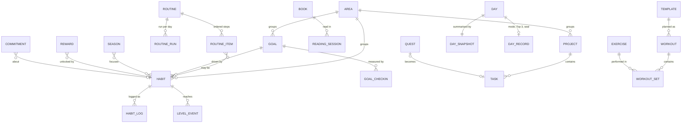

# Life OS: product architecture and build plan

The answer to the owner's [master brief](master-brief.md). It covers what Life OS should become, what is wrong with it today, and the order it gets built in.

**Status.** Phases 0–7 are done (see section 15). Phases 8–11 are next, in order.

**Committed scope.** Everything in the master brief, plus all 30 ideas agreed in conversation (listed in [section 13](#13-the-30-committed-ideas)). None of them are optional.

**How to read this.** Section 1 is a one-page summary. Sections 2 to 4 are the audit and the problems with the brief itself. Sections 5 to 12 are the architecture. Section 14 is the build plan, phase by phase. Section 17 lists the decisions the owner may want to overrule.

---

## Contents

1. [Summary](#1-summary)
2. [Where we are starting from](#2-where-we-are-starting-from)
3. [UX audit of the current app](#3-ux-audit-of-the-current-app)
4. [Contradictions and missing pieces in the brief](#4-contradictions-and-missing-pieces-in-the-brief)
5. [Product interpretation](#5-product-interpretation)
6. [UX philosophy: principles turned into rules](#6-ux-philosophy-principles-turned-into-rules)
7. [Information architecture](#7-information-architecture)
8. [User flows](#8-user-flows)
9. [Design system](#9-design-system)
10. [Motion system](#10-motion-system)
11. [Behavioral system](#11-behavioral-system)
12. [Data architecture](#12-data-architecture)
13. [The 30 committed ideas](#13-the-30-committed-ideas)
14. [Technical architecture](#14-technical-architecture)
15. [Build roadmap](#15-build-roadmap)
16. [Testing, performance and scalability](#16-testing-performance-and-scalability)
17. [Decision records and what to overrule](#17-decision-records-and-what-to-overrule)

---

## 1. Summary

**What Life OS is.** An instrument for running one person's life. You open it, it tells you where you are and the one thing to do next, you do it in a tap, it acknowledges it, and you close it. Everything else (history, analysis, configuration) lives one level down until it is useful.

**The biggest finding of the audit.** The current app tracks too much at once. Today shows **41 habits in 6 groups across 14 blocks**, the navigation has a 13-item "More" drawer, and creating a habit means a form with up to 22 fields. That is the profile of the trackers people abandon. Most of this plan removes things from the surface rather than adding them.

**The eight decisions that shape everything else** (full records in [section 17](#17-decision-records-and-what-to-overrule)):

| # | Decision | In one line |
|---|---|---|
| DR-01 | Evolve the current app, don't rewrite it | The engine (local-first storage, offline, tests) already meets the brief; the surface doesn't. |
| DR-02 | Four places plus one capture button | **Today · Plan · [+] · Progress · Reflect**. The brief's seven-item navigation is reduced to four. |
| DR-03 | Today is a "now" instrument | One primary action, the current routine open, everything else folded. |
| DR-04 | Habit states replace priorities | Focus (3) · Autopilot · Queue · Paused. Three classification systems become one. |
| DR-05 | One score, one rule | The share of today's plan that is done. Autopilot never lowers it. |
| DR-06 | Runs with grace, not streaks | A single miss never resets anything; two in a row gets a gentle flag. |
| DR-07 | One task system | Top 3 becomes three flagged tasks; projects stay flat. |
| DR-11 | Native motion, no animation library | View Transitions, Web Animations and CSS springs; HyperFrames is used to preview big moments for approval. |

**Build order.** Twelve phases, starting with an invisible foundation (migrations, sync-ready records, unit tests), then the habit system, then navigation, Today, capture, rituals, Plan, Body, Progress and Reflect, the progression layer, ceremonies and a final hardening pass. Every phase ends tested, screenshotted in light and dark mode, committed and pushed.

---

## 2. Where we are starting from

The app already meets most of the brief's technical requirements. That is why the plan evolves it instead of starting over.

| Area | Today | Against the brief |
|---|---|---|
| Stack | Vanilla ES modules, no build step, no runtime dependencies | Meets 17 and 27 |
| Storage | IndexedDB, 33 stores, in-memory cache with write-behind | Meets 16 and 28; needs a sync-ready record envelope |
| Offline | Service worker precaches 83 files; tested with the network off | Meets 19 |
| Rendering | Tagged-template HTML plus a keyed DOM morph; views lazy-loaded | Meets 27 |
| Speed | Every view renders a year of data in under 70 ms (tested) | Meets 19 and 27 |
| Tests | Playwright, 54 steps in 5 suites: flows, offline, install, sub-path hosting, a year of data | Good base; no unit tests yet |
| Design | Brand palette, Manrope, solid single-colour cards, motion tokens | Good base; type sizes are fixed pixels |
| Code size | ~546 KB of unminified JS across ~60 files; ~100 KB CSS | Fine; `today.js` and `sheets.js` (35 KB each) need splitting |

Already-built features the plan keeps: day modes (normal, minimum, rest, sick), coach suggestions, habit types (check, count, duration, checklist), the step goal that rises gradually, workouts with templates and an exercise library, nutrition, weight, measurements, photos, sleep, journal, life areas (mind, faith, relationships, work), goals, tasks, weekly and monthly reviews, backup and restore, CSV export, search, keyboard shortcuts, haptics, install prompts and manifest shortcuts.

---

## 3. UX audit of the current app

Each finding names the brief principle it breaks and the phase that fixes it.

| # | Finding | Evidence | Breaks | Fix | Phase |
|---|---|---|---|---|---|
| A1 | **Today is overloaded** | Header, score card, coach, briefing, day-complete card, shutdown, Top 3, tasks, 6 habit groups, "needs attention", win card and a "show all" toggle: 14 blocks. 41 habits are eligible. | P1, P2, P3 | Today becomes "now" (DR-03): one next action, the current routine open, everything else one line each. | 3 |
| A2 | **Too many habits in play** | 41 active habits, all shown on Today; 9 count towards the score. | P1, P24 | Focus on three (H1): 3 in training, the rest on autopilot or queued. | 1 |
| A3 | **Three overlapping ways to classify a habit** | Area, "Today group" (section) and priority (core / high / optional), plus "affects score", difficulty and goal. | P11, P18 | One area, one routine (when), one state (focus / autopilot / queue / paused). Difficulty is inferred. | 1 |
| A4 | **Creating a habit is a 22-field form** | Name, description, icon, area, group, type, unit, ideal, minimum, maximum, quick-add step, steps, frequency, days, times per period, every, start time, reminder, difficulty, goal, minimum-day label and target. | P11, P19 | Three questions (H2); the rest under "More options" with defaults. | 1 |
| A5 | **The score is unclear** | "0 of 9 key habits" while 41 are on screen; which 9 isn't visible. | P2, P22 | One score, one rule (DR-05), always explained by tapping it. | 1 |
| A6 | **"More" is a junk drawer** | 13 destinations: Tasks, Journal, Mind, Faith, Relationships, Work, Your plan, Goals, Reviews, Settings, Data, Privacy, review pages. | P2, P17 | Four places (DR-02): Plan, Progress, Reflect and a "You" sheet. | 2 |
| A7 | **Duplicated features** | Top 3 and the shutdown appear on Today and again in the Work module; "Your plan" (the playbook) repeats routines also defined as habit groups; Top 3 is a separate system from tasks. | P1, P17 | One task system (DR-07); Today owns Top 3 and shutdown; the playbook moves into Plan. | 2, 6 |
| A8 | **Inconsistent edit patterns** | Habits are edited on a full page, tasks in a sheet; some lists delete by swipe, others only from the detail page; some actions confirm with a dialog, others offer Undo. | P17 | One interaction language (DR-08): create and edit in sheets, details as pushed pages, swipe and Undo everywhere. | 2, 4 |
| A9 | **No spatial continuity** | Screens slide in from the side; nothing grows out of the card that was tapped. | P4, P5 | Card-to-detail morph via View Transitions, with the current slide as fallback. | 2 |
| A10 | **The Today header has a "back" arrow that isn't back** | The left arrow next to the date means "previous day", but it looks like navigation. | P18 | Tapping the date opens a day picker; swipe left or right on the header changes the day. | 3 |
| A11 | **Coach notes pile up** | "5 more notes" under the coach card. | P1, P22 | Exactly one suggestion at a time; the rest feed the weekly review. | 3 |
| A12 | **Metrics without decisions** | Progress lists about ten trend arrows; Body shows a Navy-formula body-fat estimate with a long caveat. | P22 | Progress shows only metrics that drive a decision; each has a "what to do" line. Estimates move one level down. | 8 |
| A13 | **Text ignores the phone's text-size setting** | All type is in fixed pixels; some labels are 9.5–10.5 px. | P26 | Type scale in rem, following the phone's text size; nothing under 11 px. | 0 |
| A14 | **No day boundary** | Logging at 00:30 counts as the next day. | P11, P19 | "My day ends at" setting, default 3:00. | 0 |
| A15 | **Recovery is partial** | Minimum and sick days exist, but a missed habit simply shows as missed, a broken streak resets, and coming back after days away shows a wall of gaps. | P24 | Runs with grace, comebacks, catch-up and fresh start (H4, U5, H9). | 1, 5 |
| A16 | **Reminders can't reach you** | Reminders appear only while the app is open; iPhone web apps can't schedule their own notifications without a server. | P12 | Calendar file and app-icon badge (U6). | 8 |
| A17 | **Habits can't be paused** | Only "archived" exists; holidays and injuries mean archiving or failing. | P24 | Pause with a return date (H8). | 5 |
| A18 | **Big files** | `today.js` and `sheets.js` are 600+ lines each. | Brief 17 | Split into components when each is touched. | 3, 4 |

Things the audit found that are **good and stay**: day modes, minimum-day essentials, the step-goal ramp, human error messages ("Couldn't save that photo. Nothing else was affected."), local-first data, offline support, keyboard reordering of Top 3, solid single-colour cards, and the reveal motion.

---

## 4. Contradictions and missing pieces in the brief

**Contradictions, and how this plan resolves them**

| # | In the brief | Resolution |
|---|---|---|
| C1 | Navigation proposes both **HOME** and **TODAY** | They are the same question ("what matters now?"). One place: Today. |
| C2 | **TRACK** and **INSIGHTS** as separate places | Users can't predict which one holds "my weight". Merged into **Progress**; insights that need action move to **Reflect**. |
| C3 | "Use **streaks**" (P25) vs "never punish missed habits" (P24) | Runs with grace (DR-06): a run survives one miss; comebacks are counted and celebrated. |
| C4 | "Levels and achievements" (P25) vs "avoid badges and fake XP" (27) | Only things earned by real behaviour: mastery levels from real repetitions, personal records, self-set rewards. No points, no currency, no badge grid. |
| C5 | "**Addictive** to use" vs "no compulsion" (14) | Pull comes from value and satisfaction, never from fear of loss. Success is measured as time-to-log and days logged, not time in the app (section 11.9). |
| C6 | "Reminders" as a habit property vs local-first privacy | iPhone web apps can't schedule notifications without a push server, and a server would receive your data. Reminders are delivered through your own calendar (U6). |
| C7 | AI insights (18) vs data staying on the device | AI stays optional and opt-in, works from summaries, and shows exactly what would be sent. The app never depends on it. |
| C8 | Projects (4) vs "tasks must not become project management" | Projects are flat: a name, an outcome and tasks. No sub-projects, dependencies or timelines. |
| C9 | "Category" as a habit property vs the app's three classification systems | One area per habit (A3). |

**Missing pieces this plan adds**

- **What the score counts.** The brief shows "76%, 5 of 7" without defining it. Defined in DR-05.
- **Day boundary.** Late-night logging needs a "day ends at" setting (A14).
- **Migrating the existing 41 habits.** The new habit system needs a one-screen sort so nothing is lost or silently changed (Phase 1).
- **Pausing.** Holidays, illness and injury need a pause with a return date, not archive-or-fail.
- **Safety before migrations.** An automatic local backup before every schema change.
- **Time zones and travel.** Dates are stored as local calendar days; the time zone at logging is recorded, so travel doesn't duplicate or lose a day.
- **Platform limits, stated plainly.** No Apple Health access from a web app (U10 works around it), no scheduled notifications on iPhone without a server (U6), and wake lock and badges depend on the iOS version (checked on the device in Phase 7).
- **Multi-device.** Not in the first version, but the data model is made sync-ready now (DR-09).

---

## 5. Product interpretation

Life OS is not a habit tracker with extra tabs. It is **one place that holds the shape of your life**: what you're building (goals, projects, habits), what today asks of you, and what the evidence says about how it's going.

It has three jobs, in order of frequency:

1. **Run the day** (many times a day). Show where I am, the next action, and take my input in one tap.
2. **Steer the week** (a few times a week). Prepare tomorrow, plan the week, notice what's slipping.
3. **Make sense of the season** (weekly to monthly). Reflect, see progress, change one thing.

The surface for job 1 must be nearly empty. Jobs 2 and 3 can be rich, because you go to them deliberately.

**What success looks like**

- From opening the app to the next action done: **under 5 seconds**.
- Logging a habit: **one tap**; logging a number: **one tap plus typing the number**.
- You close the app more often than you scroll it.
- After a missed week you come back instead of starting a new app.

---

## 6. UX philosophy: principles turned into rules

The brief's 30 principles, turned into concrete rules the interface follows. Each rule cites the principles it serves.

1. **Every screen has a primary thing, drawn larger than everything else** (P2, P14). Today: the next action. Plan: tomorrow. Progress: this week's sentence. Reflect: the writing surface. A habit page: its current run and level.
2. **Three levels, never more** (P3, P29). Glance (Today), detail (pushed page), deep (history and statistics inside the detail). Configuration lives behind "Edit" or in You.
3. **Nothing appears because data exists** (P1, P22). Each card must answer "what do I do because I know this?" Cards without an answer are removed or moved down a level.
4. **Things grow out of what you tapped** (P4, P5). Card-to-detail morphs; sheets rise from the bottom; deleted items collapse in place; new items grow in place.
5. **Response within one frame; saving happens after** (P7, P27). The interface updates before the database write; a failed write shows a human message and keeps your input.
6. **The same gesture means the same thing everywhere** (P17, P18). Tap = do or open. Hold = more options or an amount. Swipe left = not today or delete (with Undo). Swipe down on a sheet = close. Pull down on a top-level screen = search.
7. **The next action is always visible after an action** (P10). Completing something reveals the next step in the routine, or moves the Now card to the next item.
8. **Context decides what's open** (P12). Morning shows the morning routine and Top 3; evening shows what's left and the ritual; Sunday evening shows the weekly review.
9. **Defaults beat questions** (P11, P19). Today's date, last value used, your units, sensible targets. Ask only what can't be inferred.
10. **Undo instead of "Are you sure?"** (P7, P11). Confirmation dialogs remain only for irreversible bulk actions (erasing all data, restoring a backup).
11. **Typography and space do the work; colour is rationed** (P14, P15, P16). Blue appears only on the primary action, completed state and progress. Status reads through the greys.
12. **Kindness in words** (P24, P30). "Start again today", never "failed". Errors say what happened, that your data is safe, and what to do.
13. **Celebrate in proportion** (P8, P25, 27). Micro for every action, a moment for real milestones, a ceremony only at scheduled points (season end, month end).
14. **Works the same on a bad day** (P24, P26). Minimum and sick modes, larger text, reduced motion and keyboard paths are first-class, not afterthoughts.

---

## 7. Information architecture

### 7.1 Navigation (DR-02)

```
 Today      Plan      [ + ]      Progress     Reflect
 "now"   "building"  "capture"  "how it's going"  "what I learned"
```

- **Today**: the day as it is happening.
- **Plan**: what you're building: tomorrow and this week, projects, goals, habits and routines, training plan, books, playbook.
- **+ (capture)**: one field for anything: a habit, a number, a task, a note. Also holds your pinned actions.
- **Progress**: how it's going: this week, what's moving, season, records and mastery, body, areas, the year.
- **Reflect**: what you learned: today's journal, reviews due, insights with actions, journal archive, monthly films.
- **You** (sheet from the profile button on Today): profile, settings, reminders, data and backup, privacy.
- **Search**: pull down on any top-level screen, or ⌘K on a keyboard.

**Why not the brief's seven items?** Home and Today answer the same question (C1). Track and Insights split one question in two (C2). Settings is used rarely and doesn't earn a permanent place. Five or more destinations plus a "More" tab is exactly what the audit found confusing (A6).

**Where things moved from the current app**

| Current | New home | Why |
|---|---|---|
| Habits tab | Plan › Habits & routines; every habit opens from where you see it | Habits are managed rarely once the system is set up |
| Body tab | Logging: + and pinned actions. Workouts: Today ("Start workout") and Plan › Training. Trends: Progress › Body | Body is a domain, not a place; logging must be one tap from anywhere |
| More › Tasks, Your plan, Goals | Plan | All are "what I'm building" |
| More › Mind, Faith, Relationships, Work | Progress › Areas › (area page) | Areas are lenses over the same habits, goals and sessions |
| Work's Top 3 and shutdown | Today only | Removes the duplicate (A7) |
| More › Journal, Reviews | Reflect | |
| More › Settings, Data, Privacy | You | |

Old URLs redirect to their new homes, so manifest shortcuts and bookmarks keep working.

### 7.2 Screen map

```
Today
├── Header: greeting · date (tap → day picker) · day mode · You
├── Now card: score ring · one next action (button)            → habit / routine / task
├── Current routine (open, a sequence)                         → step: tap = done, hold = amount
├── Other routines (one line each: "Evening · 0/4 · 21:00")    → expands in place
├── Focus habits (the three in training, if not in a routine) → habit detail (morph)
├── Priorities & tasks: Top 3 pinned, then "also today"       → task sheet
├── Pinned actions (up to three, from "Edit Today")
└── Evening: the ritual entry → Seal the day

Plan
├── Tomorrow (and This week): Top 3 for tomorrow, dated tasks
├── Projects → project (outcome + tasks)
├── Goals → goal (metric, projection, linked habits)
├── Habits & routines: Focus · Routines · Autopilot · Queue · Paused → habit → edit (sheet)
├── Training: plan, templates, exercise library → exercise
├── Books → book (pages, notes)
└── Playbook (your rules and routines, from "Your plan")

Progress
├── This week: one sentence, score vs your ghost, days sealed
├── Moving: the three biggest changes, each with "what to do"
├── Season (when one is running)
├── Records & mastery
├── Body: weight trend, composition, measurements, photos, sleep
├── Areas → area page (mind, faith, relationships, work, ...)
└── Your year (the artwork)

Reflect
├── Today's reflection (the writing surface, opens ready to type)
├── Reviews due: day · week · month
├── Insights, each ending in an action
├── Journal archive → entry
└── Monthly films

You (sheet): profile · settings · reminders (calendar file) · data & backup · privacy · about
```

### 7.3 Relationships between places

- **Today reads, everything else writes.** Today is computed from Plan (habits, routines, tasks) plus today's logs. It never holds data of its own except the day record (mode, Top 3 order, seal).
- **Plan ↔ Progress** are two views of the same objects: a goal in Plan shows its definition; the same goal in Progress shows its trajectory.
- **Reflect consumes Progress** and writes changes back to Plan ("Apply" on an insight edits a habit, routine or task).
- **Capture writes anywhere** and lands you back where you were.

### 7.4 Hierarchy inside each place

| Screen | Primary (largest) | Secondary | One level down |
|---|---|---|---|
| Today | The next action | Current routine, Top 3 | Everything else, folded |
| Plan | Tomorrow | Projects, goals | Habit system, training, books, playbook |
| Progress | This week's sentence and score | What's moving | Charts, records, body, areas, year |
| Reflect | The writing surface | Reviews due | Insights, archive, films |
| Habit page | Current run and mastery level | This week | History, statistics, edit |
| Goal page | Projection ("on pace for 15% by March") | Linked habits | Data points |

### 7.5 Responsive layouts

- **Phone (under 600 px)**: single column; floating tab bar with the + in the middle; sheets rise from the bottom.
- **Tablet (600–1023 px)**: icon rail on the left, one column up to 720 px wide; sheets become centred panels.
- **Desktop (1024 px and up)**: labelled rail on the left. Today uses two columns: **Now** (next action, routines, focus habits) and **Day** (priorities, tasks, a timeline of routines by time). Plan and Reflect use a list-and-detail split. Progress keeps its story order in two columns; it never becomes a widget grid.
- **Keyboard**:

  | Key | Action |
  |---|---|
  | ⌘K | Capture or search |
  | 1–4 | Switch place |
  | J / K | Move through items |
  | Space or X | Complete the selected item |
  | E | Edit |
  | Esc | Close |
  | ? | Show all shortcuts |

---

## 8. User flows

Targets are counted from the screen where the flow starts. "Motion" uses the transition names from [section 10](#10-motion-system).

**1. Opening the app**
1. The app renders Today from the in-memory cache.
2. The greeting and the Now card reflect the time of day.
3. If yesterday has unlogged items, a single catch-up card appears once (U5).
4. If you've been away three or more days, the fresh-start sheet appears instead (H9).

- **Target:** interactive in under 600 ms on a mid-range phone with a year of data; no loading screen.
- **Motion:** content rises in a short stagger the first time each day; returning within the hour shows it immediately.

**2. Completing a habit**
1. Tap the circle. The ring fills and the tick draws (*completion*), with a light haptic.
2. The row settles into its done state, the score ring ticks up (*number change*), and the run counter updates.
3. If the habit belongs to a routine, the next step highlights. If it was the last focus habit, a small *moment* plays.
4. Optional: hold the row to enter an amount or note. Swipe left for "not today", which offers the backup plan (H6) before accepting.

- **Target:** 1 tap, visual response under 50 ms.
- **Edge case:** for habits fed by logged data (steps, protein), tapping opens the amount input instead of toggling.

**3. Adding a habit**
1. Tap + and type "New habit", or go to Plan › Habits › +.
2. Answer three questions (H2): *What is it?* · *When, after what?* · *What's the tiny version?*
3. Save. The habit grows into place in Focus if a slot is free, otherwise in Queue, with a line saying which and why.

- **Target:** under 30 seconds, 3 fields.
- **Defaults:** area inferred from the name and anchor (editable); daily; check type; reminder off.

**4. Editing a habit**
1. Tap the habit anywhere. Its card morphs into the habit page.
2. Tap Edit. A sheet opens with the three core fields, plus "More options" collapsed.
3. Changes save as you type, with an Undo toast on close.

- **Target:** no Save button needed; the back gesture never loses edits.

**5. Completing a routine**
1. Today shows the current routine open, as a numbered sequence with the next step highlighted.
2. Tap steps in order (the highlight advances), or tap "Did it all".
3. The routine collapses to one line ("Morning ✓ 07:42") and the next routine previews.

- **Target:** a six-step routine in 1 tap ("Did it all") or 6 taps.
- **Motion:** *collapse*, then the next routine card shifts up.

**6. Creating a goal**
1. Plan › Goals › +.
2. Answer: *What outcome?* · *By when?* · *How will you know?* Measurement choices: weight, body fat, a habit count, workouts, pages read, or a custom number.
3. Link habits; the app suggests them by area.
4. The goal page shows a projection: "On pace for 15% by 14 March" or "2 weeks behind; here's the gap."

- **Target:** 3 questions and an optional habit link.

**7. Tracking progress**
1. Open Progress. This week appears as one sentence and the score against your ghost.
2. Tap a "Moving" item. It morphs into its detail chart; tap a point to open that day.

- **Target:** the week understood in one glance; any detail in two taps.

**8. Logging a body metric**

*Path A (capture):*
1. Tap + and type "72.4".
2. The parser recognises weight from your units and recent values and shows a confirmation chip.
3. Tap the chip.

*Path B (pinned action):*
1. Tap "Log weight" on Today.
2. A numeric sheet opens, prefilled with your last value, with ±0.1 steppers.

- **Target:** 2 taps plus the number.
- **Feedback:** the 7-day average updates, with the change since last week.

**9. Writing in the journal**
1. Reflect opens straight into today's entry with the cursor in place and an optional prompt. The evening ritual can also hand you here.
2. Saving is continuous; there is no Save button.
3. Mood is one optional tap.

- **Target:** typing starts within 1 tap of opening Reflect.

**10. Reviewing a day**

The evening ritual (U4) is one question per screen:
1. Habits left: tick them or mark "not today".
2. One win.
3. Move unfinished tasks.
4. Tomorrow's first task.
5. Seal the day (G5): press and hold, a ring fills, a firm haptic, and the day becomes a tile.

- **Target:** about 60 seconds; every step skippable.

**11. Reviewing a week**

On Sunday evening, Today shows a review card; Reflect shows it too. The review runs as screens:
1. The week in numbers, as one sentence.
2. What went well (computed).
3. Where it slipped (computed).
4. One change: pick from suggestions or write your own, then Apply.
5. Next week's Top 3 and plan.

- **Target:** about 3 minutes; the change you choose is applied, not just noted.

**12. Moving between places**
- Tap a tab to cross-fade to that place, restoring its scroll position. Tap the current tab again to scroll to the top.
- A detail page pushes in (morph from the source card when there is one). Swipe from the left edge or tap back to return.
- A sheet presents over the current place; swipe it down to dismiss.

- **Target:** never more than three levels deep; you always know where you came from.

---

## 9. Design system

### 9.1 Typography

Inter in four weights (400, 500, 600, 700), following the owner's rules in [`typography.md`](typography.md): Display XL/Large/Medium for metrics, H1–H4 for titles, Body (Large, Default, Medium, Strong), Caption (and Medium), Footnote and Micro. Every role is a token in `css/tokens.css`, with mobile values by default and tablet (600 px+) and desktop (1024 px+) steps for display type and headings; `css/type.css` exposes them as semantic classes. Sizes are in rem on a 17px root, so they match the design sizes at the default text size and follow the phone's text-size setting. Fields stay at 16px or more on touch screens.

**Rules**
- Components use roles, never their own sizes or weights (unit tests enforce it).
- SemiBold is the heading weight; Bold is for exceptional moments only.
- Numbers that change or line up use tabular figures.
- Paragraphs stop at about 65 characters; the journal is a 17–18px column at 1.65 line height.
- Uppercase only for a handful of small labels (TODAY, THIS WEEK, weekday letters, table headers).

### 9.2 Colour

Already in `css/tokens.css`, from the brand palette:

| Token | Light | Dark | Use |
|---|---|---|---|
| bg | #FFFFFF | #000000 | Page |
| surface | #F5F5F7 | #1D1D1F | Cards |
| ink | #1D1D1F | #1D1D1F | Stage cards, tab bar, selections (light) |
| text / text-2 / text-3 | #1D1D1F / #434344 / #6E6E73 | #F5F5F7 / #A1A1A6 / #8E8E93 | Type hierarchy |
| accent | #0071E3 (blue text #0062C4) | #0071E3 (blue text #2997FF) | The one accent |
| sel / ink-sel | near-black | off-white / #434344 | Selected states |
| danger | #C2362B | #FF6B5E | Delete and errors only |

**Rules**
- Cards are one solid colour.
- No element carries two hues.
- Status is shown through the greys ("needs attention" is the strongest grey).
- Blue appears at most three times on a screen.
- Contrast is at least 4.5:1 for body text and 3:1 for icons and large text, checked by a test (Phase 0).

### 9.3 Space, radius and depth

- **Spacing** on a 4-point scale: 4 · 8 · 12 · 16 · 20 · 24 · 32 · 40 · 56. Phone gutter 18; desktop 32. Space between groups is always at least twice the space within them.
- **Radius**, consolidated from five values to three plus pill:

  | Radius | Use |
  |---|---|
  | 12 | Small controls, chips inside cards |
  | 20 | Nested surfaces, inputs |
  | 28 | Cards and sheets |
  | Pill / circle | Buttons, tab bar, avatars |

- **Depth**, three levels only:

  | Level | Shadow | Used for |
  |---|---|---|
  | 0 | None | Cards (flat) |
  | 1 | Soft and low | Floating elements: tab bar, toasts, the + button |
  | 2 | Deep, plus a scrim | Sheets and dialogs |

  No shadows on cards; separation comes from surface colour and space.

### 9.4 Components and their states

Each component defines every state in the brief:

| State | Definition |
|---|---|
| Default | — |
| Hover | Pointer devices only: surface one step darker |
| Pressed | Scale 0.97 over 80 ms; releases with a spring |
| Focus | 2 px blue ring, 2 px offset; always visible on keyboard focus |
| Disabled | 40% opacity, not focusable; a reason is shown when not obvious |
| Loading | Inline spinner inside the control; width stays fixed |
| Success | Check morph or confirmation line |
| Error | Message under the field, input kept, no shake |
| Empty | See 9.5 |
| Completed | Filled check; title in text-2. Tasks also strike through and fade; habits do not |

**Inventory** (★ = new or reworked):

| Category | Components |
|---|---|
| Actions | Button: primary, secondary, ink, ghost, destructive; sm / md / lg · Icon button · ★ Hold button (press-and-hold with progress ring, used for Seal the day and Commitments) · ★ Capture button |
| Rows | ★ Habit row (tap / hold / swipe) · Task row · Metric row · ★ Routine step |
| Cards | Card: flat, ink, accent · ★ Now card · ★ Routine card |
| Progress | Ring · Progress bar · Check (morphing) |
| Inputs | Stepper · Segmented control · Chip · Toggle · Text input · Text area · ★ Number pad sheet · ★ Day picker (week strip and month) |
| Overlays | Sheet (★ detents: medium, large; drag physics) · Dialog (rare) · ★ Context menu (hold or ⋯) · Toast (with Undo) |
| Navigation | Tab bar / rail · ★ Search pull-down |
| Data | Charts: bar, line, spark, heat · ★ Ghost marker |
| Feedback | Empty state · Inline error · ★ Celebration layer |

There are no skeleton loaders: data is local and renders immediately. A skeleton would be a lie.

### 9.5 Empty states and errors

| Where | Empty state |
|---|---|
| No habits in focus | "Build your first daily system. Pick up to three habits to start." [Choose habits] |
| No goals | "What are you working toward?" [Add a goal] |
| No journal today | "Start today's reflection." (cursor already in place) |
| Progress, first week | "Your patterns will appear here as you use Life OS. Three days in, the first ones show." |
| No tasks today | "Nothing scheduled. Add one, or enjoy the space." |
| No records yet | "Records appear the first time you beat yourself." |

**Error copy pattern:** what happened · your data is safe · what to do. For example: "That didn't save. Your entry is still here. Try again." Inputs are never cleared on error.

**Write failures** are retried automatically. If storage is full, the app says so and offers to export old photos.

### 9.6 Voice

Short, warm and specific. Second person. No exclamation marks except in ceremonies. Never "failed", "streak lost" or "you broke". Numbers before adjectives ("5 of 7 done", not "Great job!").

---

## 10. Motion system

### 10.1 Tokens

| Token | Value | Use |
|---|---|---|
| `--dur-instant` | 80 ms | Press feedback |
| `--dur-fast` | 140 ms | Checks, toggles, chips, tab cross-fade |
| `--dur-med` | 240 ms | Sheets, expand and collapse, list changes |
| `--dur-slow` | 380 ms | Page push and pop, card-to-detail morph |
| `--dur-ceremony` | 600–1600 ms | Moments and ceremonies only |
| `--ease-standard` | cubic-bezier(.2, .8, .2, 1) | General movement |
| `--ease-enter` | cubic-bezier(.16, 1, .3, 1) | Things arriving |
| `--ease-exit` | cubic-bezier(.4, 0, 1, 1) | Things leaving (quicker than entering) |
| `--spring-snappy` | CSS `linear()` spring, about 300 ms settle | Press release, check, toggles |
| `--spring-gentle` | CSS `linear()` spring, about 500 ms settle | Sheets, morphs |

Springs use the CSS `linear()` easing (Safari 17.2+, Chrome 113+), falling back to `--ease-enter`. **Gestures** follow the finger one-to-one; on release the element continues with the gesture's speed into a spring. A sheet dismisses past 30% of its height or on a fast flick.

### 10.2 Rules

1. Animate only `transform` and `opacity`. Height changes use FLIP: measure, then animate a transform.
2. Scale stays within 0.96–1.02 for interface elements.
3. Exits are shorter than entrances.
4. Staggers: 30–40 ms per item, at most five items, then the rest arrive together.
5. One focal motion at a time; nothing else moves during a morph.
6. Nothing loops in the interface except progress indicators.
7. Every motion maps to a change the user should notice (P5). If it doesn't, it's removed.

### 10.3 Transition catalogue

| Name | When | How |
|---|---|---|
| **Push / pop** | Opening a detail with no source card | Incoming slides 22 px and fades in at `--dur-slow`; outgoing dims |
| **Morph** | Card → its detail page | View Transitions: the card's shape becomes the page header; content fades in after. Fallback: push |
| **Sheet** | Create, edit, capture | Rises with `--spring-gentle`; scrim fades; drag to dismiss |
| **Expand / collapse** | Routine cards, folded sections | FLIP height, content cross-fades |
| **Insert / remove** | Lists | New items grow from 0 to full height and fade in; removed items collapse and fade; Undo reverses the same path |
| **Completion** | Check, routine step | Ring fills (140 ms), tick draws (160 ms), row settles, haptic; score number then ticks |
| **Number change** | Scores, totals | 600 ms count with a slight blur that sharpens as it settles (already built) |
| **Progress fill** | Rings, bars | `--dur-med` with `--ease-standard` |
| **Tab switch** | Changing place | 140 ms cross-fade; no slide (places are peers, not a stack) |
| **Toast** | Confirmations, Undo | Rises 12 px and fades in; leaves the same way |

### 10.4 Celebrations, in three tiers

| Tier | Trigger | Length | Example |
|---|---|---|---|
| **Micro** | Every completion | Under 300 ms | Check morph and haptic |
| **Moment** | Last focus habit of the day, personal record, new mastery level, reward unlocked | 1–2 s, inline, never blocks | A fine blue line draws around the card; the number counts up; the level plate engraves |
| **Ceremony** | Seal the day, season finale, monthly film, year artwork | 2–30 s, full screen, tap to skip | Seal the day folds into a tile; the monthly film plays as a story |

**Rules**
- At most one moment per action.
- Ceremonies happen only at scheduled points or at your request.
- No confetti and no rainbow colours: motion comes from light, line and type in black, white and blue.
- Optional sound is synthesised in the browser and off by default.

### 10.5 HyperFrames and reduced motion

**HyperFrames.** Each moment and ceremony is first rendered as a short HyperFrames preview video for the owner to approve. The in-app version is then built in plain JavaScript (Web Animations, SVG, canvas) to the approved timing. HyperFrames renders locally and costs no generation credits; it is never shipped in the app.

**Reduced motion.** When the phone asks for reduced motion:
- movement becomes a 120 ms fade;
- morphs become cross-fades;
- ceremonies become a still summary card;
- number counts jump to their final value.

---

## 11. Behavioral system

### 11.1 The loop

**See** (the Now card) → **decide** (one suggested action) → **act** (one tap) → **feedback** (micro) → **progress** (score, run, level) → **next** (the next step is revealed) → **return** (tomorrow's first task and the sealed day give a reason to come back).

### 11.2 Habit states (H1)

| State | On Today? | Logged? | Counts in score? |
|---|---|---|---|
| **Focus** (max 3) | Yes | Daily | Yes |
| **Routine step** | Inside its routine | Daily (or "Did it all") | As part of its routine |
| **Autopilot** | No (unless in a routine) | Weekly "still doing these?" | No |
| **Queue** | No | — | — |
| **Paused** (until a date) | No | — | — |
| **Archived** | No | — | — |

- **Graduation.** When a focus habit is done (including the tiny version) on at least 85% of scheduled days over the last six weeks, and has 30 or more completions, the app *suggests* moving it to autopilot. You confirm, and the next habit from the queue takes the free slot.
- **Weekly autopilot check.** A "no" moves the habit back to focus or queue. Nothing moves without your tap.

### 11.3 The score (DR-05)

> **Today's score is the share of today's plan that is done.**

- **Planned items:** each routine (1 item, with partial credit for steps done), each focus habit (1 item) and each Top 3 priority (1 item).
- **Tiny versions count as done.** The score shows "5 of 8 · 2 tiny".
- **Autopilot never lowers the score.**
- **Day modes change the plan:**
  - *Minimum day:* the plan is the tiny versions of focus habits plus the essentials.
  - *Sick day:* scoring pauses.
  - *Rest day:* training habits leave the plan.
- **Tapping the score** shows exactly what is counted.

### 11.4 Runs, comebacks and the tiny version (H3, H4)

- **A run continues through one miss.** Only two scheduled misses in a row end it.
- After one miss, the habit shows a quiet "Don't miss twice" line. After two, the app offers to shrink or pause the habit (H7, H8) instead of showing a broken streak.
- **Comebacks are counted:** completing after a miss is a comeback, shown on the habit page ("6 comebacks this month").
- **Every habit has a tiny version.** Logging it is one hold on the row, or automatic on a minimum day.

### 11.5 Progression (G1–G4, G7–G9)

- **Mastery levels** come from total completions:

  | Level | Completions |
  |---|---|
  | Started | 1 |
  | Practised | 10 |
  | Steady | 30 |
  | Second nature | 66 |
  | Mastered | 150 |

  66 echoes research showing habits take a median of about 66 days to become automatic (Lally et al., 2009). "Second nature" is when graduation is suggested. Each level is an engraved plate with its date.
- **Personal records** are detected automatically from real data: best protein week, heaviest lift per exercise, longest run, most focus hours, earliest average wake time over a week. A record needs at least three prior data points, so the first entries don't trigger it.
- **Seasons** last six weeks, start on a Monday and have a name, three focus habits and one intention. There is a mid-season check-in on week 3 and a finale (ceremony) with a frozen summary.
- **Ghost:** this week's score so far, compared with your best week or the same day four weeks ago. It is a thin marker, never a red alarm.
- **Rewards you set** are tied only to real counts or outcomes (workouts, completions, sealed days, season score, a goal reached). No points, no currency.
- **Commitments** are 7, 14 or 30-day pledges with your own stake, sealed with a hold. Ending one early asks "what got in the way?" and offers a smaller pledge.
- **Side quests:** one optional suggestion a week, from a library per area, filtered towards what you don't usually do. Accepting turns it into a task.

### 11.6 Recovery (U5, H6, H9, H10)

- **Catch-up:** the morning after an unlogged day, one card asks you to tap what you did.
- **Fresh start:** after three or more days away, the gap is marked "away", not "missed". You choose one to three habits for the week.
- **Backup plans:** "If it rains → 20 minutes at home" is offered when you swipe "not today".
- **Your why:** one line about who the habit makes you, shown at the moment you'd skip, with the count of times you showed up as that person this month.

### 11.7 Adapting the system (H7, H8)

- **Shrink:** three misses in a week suggest a smaller target for two weeks.
- **Grow:** two weeks at 95% or more suggest a 10% step up.
- Never more than one suggestion per habit per fortnight, and never automatic.
- **Weekly tidy-up:** habits untouched for 14 days come up as keep / shrink / pause until / archive. It takes 30 seconds.

### 11.8 Weekly reflection

The weekly review (flow 11) closes the loop: computed wins and slips, one chosen change that is applied to Plan, and next week's Top 3. Insights (U8) always end in a concrete action; an insight you can't act on is not shown.

### 11.9 Healthy-engagement guardrails

**Never**
- streak-loss warnings
- "come back" notifications
- time-in-app goals
- infinite feeds
- leaderboards or other people
- random rewards
- countdown pressure, except for commitments you set yourself

**Always**
- a clear "done for today" state that invites you to close the app
- quiet hours
- celebrations only once per event

**Measured on the device, never sent anywhere**
- median time from opening the app to the first log;
- share of habits logged on the same day;
- days sealed per week.

The aim is for the first to fall and the other two to rise.

---

## 12. Data architecture

### 12.1 Record envelope (DR-09)

Every record in every store carries:

```
id          UUID (deterministic for day-keyed records, e.g. "habitId:2026-10-07")
createdAt   ISO timestamp
updatedAt   ISO timestamp
deletedAt   ISO timestamp or null (tombstone, so deletes can sync later)
rev         integer, +1 per write
date        'YYYY-MM-DD' local calendar day, for day-keyed records
tz          IANA time zone at write time, for day-keyed records
```

Deterministic ids for day-keyed records mean two devices logging the same habit on the same day produce the same record, not a duplicate, once sync exists.

### 12.2 Entities

The brief's models (left column) mapped to the store that holds them (★ = new store, ◆ = changed).

| Brief model | Store | Key fields |
|---|---|---|
| User | `profile` ◆ | name, units, height, birth year, time zone, **dayEndsAt** (default 03:00), weekStartsOn (Monday) |
| Settings | `settings` ◆ | theme, haptics, sound, pinned actions (≤ 3), Today layout (order, hidden), quiet hours |
| — (area) | `areas` ★ | id, label, icon, order, module id (lets Finance plug in later) |
| Habit | `habits` ◆ | name, **areaId**, **state** (focus / autopilot / queue / paused / archived), **pausedUntil**, **routineId**, **anchor** ("after I pour coffee"), type, unit, target {ideal, max}, **tiny** {label, target}, schedule, preferredTime, **why**, **backup** {if, then}, goalId, adaptive (on/off), notes, source (manual or derived) |
| HabitCompletion | `habitLogs` ◆ | habitId, date, **status** (done / tiny / skipped), value, note, **via** (tap / routine / capture / catch-up / derived), at |
| Routine | `routines` ★ | name, kind (morning / evening / custom), window {from, to}, order, **steps**: RoutineItem[] |
| RoutineItem | embedded in `routines.steps` | id, habitId or label, minutes. Embedded because steps are always read and edited with their routine |
| Routine run | `routineRuns` ★ | routineId, date, steps done, completedAt (holds steps that aren't habits, e.g. "make the bed") |
| Goal | `goals` ◆ | title, areaId, kind (metric / count / milestone), measure {source, start, target, direction}, deadline, status, why |
| GoalProgress | `goalCheckins` ★ for custom measures; otherwise derived | goalId, date, value, note |
| Task | `tasks` ◆ | title, date or null (anytime), **projectId**, **focusRank** (1–3 = Top 3; replaces the separate Top 3), repeat, done, doneAt, note, **questId** |
| Project | `projects` ★ | title, outcome, areaId, status (active / someday / done), due, order |
| JournalEntry | `journalEntries` | date, text, mood, prompt |
| Workout (plan) | `templates` | name, exercises, targets |
| WorkoutSession | `workouts` + `workoutSets` | date, templateId, status, started/ended; sets: exerciseId, reps, load, RPE |
| — (exercise) | `exercises` | name, category, equipment |
| BodyMetric | `weightEntries`, `measurements`, `bodyFatEstimates`, `sleepEntries`, `waterLogs`, `stepLogs`, `nutritionLogs` | Kept as typed stores (DR-10) behind one metrics service |
| ReadingItem | `books` ★ (+ `readingSessions` gains bookId) | title, author, pages, current page, status, started, finished, notes |
| Review | `dailyReviews` ◆ (day record), `weeklyReviews`, `monthlyReviews` ◆ | day: mode, Top 3 order, win, energy, tomorrowFirst, **sealedAt**; week/month: answers, chosen change, applied actions |
| DailySnapshot | `daySnapshots` ★ (derived cache) | date, score, planned, done, tiny, mode, sleep, weight7, steps, protein, workouts, mood, energy, journal words, sealed, area scores |
| Notifications | `reminders` ★ (schedules) + `reminderLog` | target (habit / routine), time, days, calendar export flag |
| — (seasons) | `seasons` ★ | name, start, end, focus habitIds, intention, summary (frozen at end) |
| — (records) | `records` ★ | kind, ref (exerciseId / habitId), value, date, previous |
| — (levels) | derived from logs; `levelEvents` ★ | habitId, level, date (so the plate's date never changes) |
| — (rewards) | `rewards` ★ | title, condition {kind, ref, target}, status, unlockedAt |
| — (commitments) | `commitments` ★ | title, days, start, stake, habitId, status, sealedAt, outcome |
| — (quests) | `quests` ★ | weekStart, templateId, title, areaId, status, taskId |
| — (insights) | `insights` ★ | ruleId, period, text, action {kind, payload}, status (shown / applied / dismissed) |
| — (sync) | `outbox` ★ | store, id, op, rev, at |

### 12.3 Relationships



The **day** is the hub. Every day-keyed record carries `date`, and the day snapshot summarises them. That is what Progress, the ghost, the year artwork, the recap film, insights and future AI all read.

### 12.4 Derived data

- **Day snapshots** are recomputed when any record for that day changes, debounced and off the interaction path. Past days are cached; today is computed live.
- **Levels and records** are derived, but the *moment they were reached* is stored as an event, so history never shifts when targets change.
- **Statistics** (runs, comebacks, consistency) are pure functions over logs. They are memoised per store version, as `store.memo` does today.

### 12.5 Migrations and safety

- `DB_VERSION` moves to 3 with a **migration list**: ordered, idempotent functions, each tested against fixtures.
- **Before any migration, the app writes a local backup** (an IndexedDB snapshot plus the last exported JSON) and keeps the last three.
- **Existing data maps over without loss:**

  | From | To |
  |---|---|
  | priority core / high | focus or autopilot, after your one-screen sort |
  | priority optional | queue |
  | section | routine membership, for morning and evening |
  | `dailyReviews.top3` | tasks with focusRank |
  | minimum-day label and target | the tiny version |

- **Backup format versioning:** files from v2 import into v3 through the same migrations.

---

## 13. The 30 committed ideas

IDs used throughout this plan, with the phase that delivers each.

**Usability (U)**

| ID | Idea | Phase |
|---|---|---|
| U1 | Today shows "now", not everything | 3 |
| U2 | One "+" that understands you (type or dictate) | 4 |
| U3 | Log without opening anything (tap / hold / swipe) | 4 |
| U4 | 60-second morning and evening rituals | 5 |
| U5 | Catch up instead of guilt, plus Undo everywhere | 4, 5 |
| U6 | Private reminders: calendar file and app-icon badge | 8 |
| U7 | Make Today yours: reorder, hide, pin three actions | 3 |
| U8 | Insights that end in one tap | 8 |
| U9 | Gym mode | 7 |
| U10 | Apple Health without typing (Shortcut and paste) | 7 |
| U+ | Text follows the phone's text-size setting | 0 |

**Habit formation (H)**

| ID | Idea | Phase |
|---|---|---|
| H1 | Focus on three, with graduation to autopilot | 1 |
| H2 | A new habit takes three questions | 1 |
| H3 | The tiny version always counts | 1 |
| H4 | "Never miss twice" instead of streaks | 1 |
| H5 | Link habits into routines | 3 |
| H6 | A backup plan for each key habit | 5 |
| H7 | Habits that shrink and grow with you | 5 |
| H8 | 30-second weekly tidy-up, with pause | 5 |
| H9 | Fresh start after time away | 5 |
| H10 | Your why, at the moment you'd skip | 5 |

**Game layer (G)**

| ID | Idea | Phase |
|---|---|---|
| G1 | Seasons | 9 |
| G2 | Race your past self (ghost) | 9 |
| G3 | Personal records | 9 |
| G4 | Mastery levels per habit | 9 |
| G5 | Seal the day | 5 (interaction), 10 (ceremony) |
| G6 | Your year as artwork | 10 |
| G7 | Rewards you set yourself | 9 |
| G8 | Commitments | 9 |
| G9 | Side quests | 9 |
| G10 | Monthly recap film | 10 |

---

## 14. Technical architecture

### 14.1 Layers

```
Screens (js/screens)      render HTML from state, map gestures to actions
        ↓
Domain (js/domain)        pure rules: habits, routines, scoring, runs, levels, records, capture parser, insights
        ↓
Data services (js/data)   store: in-memory cache, subscriptions, memo, batch writes, outbox
        ↓
Adapter (js/data)         IndexedDB today; a sync adapter later, behind the same interface
```

Screens never touch IndexedDB. The domain layer never touches the DOM. That is the brief's UI → logic → services → storage, and it is mostly how the code already works. The changes formalise it.

### 14.2 Folder structure

The current folders are renamed once, in a single mechanical commit, so the names say what each layer is: `core` → `domain`, `db` + `store.js` → `data`, `views` → `screens`. Large files are then split as each phase touches them.

```
life-os/
├── index.html · manifest.webmanifest · sw.js
├── css/
│   ├── tokens.css         colour, type, space, radius, depth, motion tokens
│   ├── base.css           reset, shell, layout, responsive rules
│   ├── motion.css ★       transitions, View Transitions names, reduced-motion map
│   ├── components.css     shared components
│   └── screens/ ★         today.css, plan.css, progress.css, reflect.css, ...
├── js/
│   ├── app.js             shell: boot, router wiring, delegation, tab bar
│   ├── data/              store.js, adapter-idb.js ★, schema.js, migrations.js ★, outbox.js ★, seed.js, backup.js
│   ├── domain/            habits, routines ★, scoring, runs ★, levels ★, tasks, projects ★, goals, metrics,
│   │                      fitness, capture ★ (parser), snapshots ★, insights ★, seasons ★, records ★,
│   │                      rewards ★, commitments ★, quests ★, reminders, ics ★, dates, taxonomy
│   ├── ui/                dom, patch, router, sheet, toast, haptics, icons, charts, gestures ★,
│   │                      motion ★, transitions ★, components/ ★ (now-card, routine-card, habit-row, ...)
│   ├── screens/           today/ ★ (split), plan/, progress/, reflect/, you/, habit, goal, project ★,
│   │                      workout, gym ★, journal, review-*, season ★, ...
│   └── ceremony/ ★        celebrate, seal, moment, season-finale, recap-film, year-art, sound
├── tests/                 unit/ ★ (node:test), e2e/ (Playwright), fixtures/ ★ (v1/v2 backups, a year of data)
├── tools/                 build-sw, build-icons, render-icons, check-budgets ★
└── docs/                  master-brief.md, product-architecture.md
```

### 14.3 State management

- **One store** (`data/store.js`): an in-memory cache of every store, loaded at boot. It has synchronous reads, `subscribe`, `memo(key, stores, fn)` for derived data, and `batch` for atomic multi-store writes. This is already how it works.
- **Writes are optimistic:** the cache updates and the interface re-renders in the same frame; the IndexedDB write follows, coalesced.
- **Writes are flushed on `visibilitychange` and `pagehide`,** so closing the app never loses data.
- **Screen state** (open sections, drafts) lives per route in memory. Drafts of long text (journal, notes) are also mirrored to the store as you type.
- **No framework and no global event bus.** Actions are named functions on each screen, dispatched by delegation (as today).

### 14.4 Rendering

- Tagged-template `html` with auto-escaping, and a keyed morph (`patch`) that preserves focus, scroll and input state. This exists already.
- Components are functions returning `html`, plus optional `mount` and `update` hooks for gestures and animations.
- View Transitions wrap route changes and morphs where supported. `patch` runs inside the transition callback.
- Long histories use `content-visibility: auto`.

### 14.5 Persistence and resilience

- IndexedDB through the adapter interface: `open`, `getAll`, `put`, `delete`, `transaction`.
- **Storage persistence** is requested (`navigator.storage.persist()`), so the browser doesn't evict data.
- **Automatic local backups** before migrations; a monthly prompt to export a file (one tap; it lands in Files on the phone).
- **The outbox** records every change (store, id, rev). Nothing reads it yet; it is the hook for future sync.
- localStorage is used only for tiny per-device conveniences (last tab, celebrated-today flags), always inside try/catch.

### 14.6 Calculations

All rules are pure functions in `domain/`, so they can be unit-tested without a browser: score, runs, comebacks, levels, graduation, adaptive targets, records, the ghost, season summaries, the capture parser, the iCalendar generator, day-boundary date maths and snapshot building.

### 14.7 Platform features, with fallbacks

| Feature | Used for | Fallback |
|---|---|---|
| View Transitions (Safari 18+, Chrome 111+) | Morphs | Push / pop slide |
| CSS `linear()` (Safari 17.2+) | Springs | cubic-bezier |
| Screen Wake Lock | Gym mode | Warning when the screen locks; the timer keeps time from timestamps |
| Badging API (home-screen app, permission) | Icon badge | None needed |
| Clipboard read (on tap) | Apple Health paste | Manual entry |
| MediaRecorder + canvas | Saving the monthly film | Save a still poster |
| Vibration / iOS switch haptic | Haptics | Visual only |

Wake lock, badges and clipboard behaviour are verified on the owner's iPhone in Phase 7, because iOS support for home-screen apps varies by version.

---

## 15. Build roadmap

Twelve phases. Each lists objective, features, files, dependencies, acceptance criteria, tests and UX considerations. Relative size: S / M / L.

### How each phase is built

1. Write unit tests for the new domain rules first.
2. Build the domain logic, then the screens.
3. Run every suite (unit, e2e, offline, a year of data), then screenshot each touched screen in light and dark mode, on phone and desktop.
4. Self-review against the quality bar (brief 28) and the Apple test (brief 13), and fix what fails.
5. Commit, push, and send the owner the screenshots plus a short note of what changed and anything to decide.
6. Moments and ceremonies only: render HyperFrames previews and wait for approval before building them in.

### Phase 0: Foundations and safety net (L) · done

What shipped, against the acceptance criteria: all 54 earlier steps still pass; a real version 2 database upgrades with identical record counts and a safety copy taken first; a version 2 backup file restores and catches up; 400 records written right before a reload all survive; every main screen and the check-in sheet keep their text uncut at 85% and 200% text size. 29 unit tests and 9 new browser steps cover it. Secondary and tertiary text moved to the brand dark and mid greys, and blue text to the deeper brand blue, so every text colour clears 4.5:1. JavaScript for the first render is 202 KB against the 200 KB target (well inside the 240 KB limit); Phase 3's split of the Today screen brings it under.

- **Objective:** make the codebase ready for everything else, with no visible change except text size.
- **Features:**
  - Folder rename (`domain` / `data` / `screens`).
  - Record envelope (deletedAt, rev, tz).
  - Migration framework with automatic local backup.
  - Outbox.
  - Adapter interface.
  - Day boundary setting.
  - Day snapshots.
  - Unit-test runner (`node --test`, no dependencies).
  - Motion tokens and `ui/motion.js` (spring presets, FLIP helper, reduced-motion map).
  - rem type scale following the phone's text size (U+).
  - Contrast test.
  - Empty-state and inline-error components.
  - Storage persistence request.
  - Budget checker (`tools/check-budgets.mjs`).
- **Files:** all of `js/` (rename); `data/*`, `domain/dates.js`, `domain/snapshots.js`, `ui/motion.js`, `css/tokens.css`, `css/motion.css`, `tests/unit/*`, `tools/check-budgets.mjs`.
- **Depends on:** nothing.
- **Acceptance:**
  - All 54 existing e2e steps pass unchanged.
  - A v2 backup imports into v3 with identical counts.
  - A forced reload during a batch write loses nothing.
  - Text scales from 85% to 200% without overflow on every screen.
- **Tests:** migration fixtures, day-boundary maths, snapshot builder, contrast test for all text tokens, an overflow test at 200% text.
- **UX:** nothing should look different, except larger text if your phone uses it.

### Phase 1: The habit system (L) · done

What shipped, against the acceptance criteria: after the sort, Today shows at most three focus habits (in their own block) and nothing twice; the score explains itself from a tap on the ring or the number; one miss never resets a run, and comebacks are counted; a new habit takes three fields in a sheet, well under 30 seconds; the sort, the migration and every state change keep habit and log counts identical. Until routines arrive in Phase 3, Today's time-of-day groups hold the habits on autopilot (they count nothing). A minimum-day tap logs the tiny version. *Not yet* on a graduation suggestion puts it off for two weeks. Free-text habit answers grow to fit instead of cutting text off at large sizes. 47 unit tests and 12 new browser steps cover it; first-render JavaScript is 222 KB (limit 240 KB), and Phase 3's split of Today brings it back under the 200 KB target.


- **Objective:** make the system smaller and kinder before redesigning any screen.
- **Features:**
  - Habit states and Focus on three, with graduation suggestions (H1).
  - **One-screen sort of your 41 habits** into Focus (3), Autopilot, Queue and Paused, with suggestions pre-filled from current priorities.
  - Three-question creation (H2).
  - Tiny version on every habit (H3).
  - Runs with grace and comebacks (H4).
  - Score redefinition (DR-05) with "what counts" on tap.
  - Habit page reorganised by progressive disclosure (run and level → this week → history → statistics).
  - Simplified habit editor (core fields plus "More options").
- **Files:** `domain/habits.js`, `domain/scoring.js`, `domain/runs.js` ★, `data/migrations.js`, `screens/habit*.js`, `screens/habit-sort.js` ★, the Today score card.
- **Depends on:** Phase 0.
- **Acceptance:**
  - After the sort, Today shows at most 3 focus habits plus routines.
  - The score explains itself.
  - A single miss never resets a run.
  - A new habit takes 3 fields and under 30 seconds.
  - No habit or log is lost (counts before = after).
- **Tests:** unit (score, runs, comebacks, graduation, tiny); e2e (sort flow, create flow, miss-then-comeback over simulated days).
- **UX:** the sort must feel like relief, not homework. One screen, drag or tap, sensible suggestions, and an "I'll decide later" path that defaults safely.

### Phase 2: Navigation and the spatial model (M) · done

What shipped, against the acceptance criteria: every older address (35 of them, in `js/routes.js`) lands on its new home; a crawl from the four places reaches every screen in three levels or fewer (a workout page opens from starting or reviewing a session); back restores the exact scroll position, and a list beside its detail keeps its own; Tab reaches every control on Today and 1–4, J/K, X, E, N, / and ? work without a mouse; a View Transition with a title morph drops no more than three frames in the test profile, and reduced motion turns it into a fade. Plan, Reflect, the area pages, You and capture are new; More and the Body tab are gone (Body lives under Progress, with logging one tap away on +). The habit editor became a sheet that saves as you go, and deletes use Undo instead of a confirmation. First-render JavaScript is 233 KB (limit 240 KB) after reminders' rules and the migrations moved out of the start-up path; Phase 3's split of Today brings it under the 200 KB target. 48 unit tests and 16 new browser steps cover it.


- **Objective:** four places, one interaction language, things growing out of what you tap.
- **Features:**
  - Tab bar: Today · Plan · + · Progress · Reflect.
  - You sheet.
  - Area pages replacing the life modules.
  - Redirects from old routes.
  - Morph transitions (View Transitions) and sheet physics (detents, drag dismiss).
  - Search pull-down and ⌘K.
  - Desktop rail and list-and-detail layout.
  - Keyboard shortcuts and a "?" overlay.
  - One edit pattern (sheets) and one delete pattern (swipe and Undo).
- **Files:** `app.js`, `ui/router.js`, `ui/transitions.js` ★, `ui/gestures.js` ★, `ui/sheet.js`, `screens/plan/*` ★, `screens/progress/*`, `screens/reflect/*` ★, `screens/you.js` ★, `screens/area.js` ★, `css/base.css`, `css/motion.css`.
- **Depends on:** Phase 1 (Plan shows the habit states).
- **Acceptance:**
  - Every old route lands on its new home.
  - Every screen is reachable in three levels or fewer.
  - Back always returns to the exact scroll position.
  - Keyboard-only navigation reaches every control.
  - Morphs run at 60 fps on the test phone profile.
- **Tests:** e2e of the route map, keyboard-only pass, reduced-motion pass, focus-order check.
- **UX:** the Body tab disappearing is the biggest change, so pinned "Log weight" and "Start workout" ship in this phase to keep body logging one tap away.

### Phase 3: Today (L) · done

What shipped, against the acceptance criteria: at most six blocks on first load at every hour tested (07:00, 13:00, 21:00, 00:30), with the next action above the fold on a phone; the six-step Morning routine finishes in one tap ("Did it all", with Undo); Today renders in about 10 ms with a year of data and three habits in focus (budget 70 ms), using the same code on the first open and the hundredth. Decisions made on the way: the day's Top 3 became tasks with a rank (DR-07), migrated from the old per-day lists; Morning and Evening routines are built from the habits you had grouped that way, and every other habit on autopilot sits under "Everything else", folded; the coach's one suggestion joins the Now card rather than having its own card; the clock left the date button, which now opens a day picker (swipe the header to move a day). First-render JavaScript fell from 257 KB to 204 KB (the rarer icons, the task sheet, the coach, habit-system changes and the redirect table load on demand); the last 4 KB to the 200 KB target is left for Phase 11. 69 unit tests and a new 11-step Today suite cover it.


- **Objective:** opening the app answers "what now?" in one glance.
- **Features:**
  - Now card with a next-action engine (time, routine, focus, Top 3, overdue).
  - Routines as sequences (H5): data model, editor and routine cards, with steps in order and "Did it all".
  - The current routine open, others one line each (U1).
  - Priorities and tasks merged (Top 3 pinned).
  - One coach suggestion only.
  - Date picker instead of the arrow.
  - "Edit Today": reorder, hide, and pin three actions (U7).
  - Done-for-today state.
- **Files:** `screens/today/*` (split into now-card, routine-card, priorities, focus, evening), `domain/routines.js` ★, `domain/next-action.js` ★, `domain/tasks.js`, `css/screens/today.css`.
- **Depends on:** Phases 1 and 2.
- **Acceptance:**
  - At most 6 blocks visible on first load at any time of day.
  - The next action is visible without scrolling on a phone.
  - A six-step routine completes in one tap.
  - The 100th open is as quick as the first (no first-run-only tricks).
- **Tests:** unit (next-action rules across times of day and modes); e2e (morning, midday and evening states, routine flow, Edit Today); year-of-data render under 70 ms.
- **UX:** test at 07:00, 13:00, 21:00 and 00:30 (day boundary), on minimum and sick days.

### Phase 4: Capture and logging (M) · done

What shipped, against the acceptance criteria: the parser reads a 167-phrase table with every phrase right and none logged as something else (the bar was 95% and no silent mislogs); anything it can't be sure of is a question with the readings to pick from, a line about the future becomes a task, and what it understood (what, how much, which day) is always shown before saving. Hold and swipe work with real touch input, and each has a labelled button in the habit's sheet; Undo restores every record exactly, including ones that existed before. Decisions made on the way: *Not today* is stored on the day's habit log, takes the habit out of the day's plan and score, and counts as the run's one allowed miss (so it never pretends the habit was done); a hold logs the tiny version when there is one and opens the number pad for habits that count something; weight and steps open on the number pad with the last value; right-click is the hold on a computer; things logged where they live (the journal, a workout, the shutdown) open there instead of being guessed; quick water adds gained Undo. The only confirmation dialogs left are the whole-device ones (restore, erase), as planned. First-render JavaScript is 208 KB (target 200 KB), left for Phase 11 with the rest of the budget work.


- **Objective:** logging anything takes one gesture or one line.
- **Features:**
  - The + capture sheet with a local parser (U2): numbers with units, habit names, "walked 30 min", "call mum Friday", "read 20 pages". Suggestions as you type; dictation through the keyboard microphone.
  - Gestures on rows (U3): tap, hold for an amount or tiny version, swipe for not today.
  - Undo on every action, and confirmation dialogs removed (U5, part 1).
  - Haptics map.
  - Number pad sheet with the last value prefilled.
- **Files:** `domain/capture.js` ★, `screens/capture.js` ★, `ui/gestures.js`, `ui/components/habit-row.js` ★, `ui/toast.js`, `ui/haptics.js`.
- **Depends on:** Phase 3.
- **Acceptance:**
  - The parser handles a 150-phrase test table with at least 95% correct and never silently mislogs (anything ambiguous asks).
  - Every gesture has a visible alternative (accessibility).
  - Undo restores exactly.
- **Tests:** parser table (unit), gesture e2e with touch emulation, screen-reader labels.
- **UX:** the parser must be predictable. It always shows what it understood before saving.

### Phase 5: Rituals and resilience (L) · done

What shipped, against the acceptance criteria: the evening ritual asks only what applies (habits left, one win, unfinished tasks, tomorrow's first task) and ends with sealing the day as a press and hold; five screens took under six seconds automated, so about a minute by hand, and every step skips without saving anything. After a simulated five-day absence Today shows a fresh start instead of misses: the gap is marked *away*, runs carry on over it (a 30-day run stayed intact in the test), and no catch-up list appears. Shrink and grow suggestions never repeat within 14 days (tested day by day). Decisions made on the way: the morning check-in became the morning ritual (sleep, how you feel, an optional weigh-in, your three) and is the Now card's first action; *away* is a day mode set only by a fresh start, treated like a sick day by runs and scores and never offered in the mode picker; shrinking sets a two-week temporary target (or "just the tiny version" for yes/no habits, or a pause when there is no tiny version), which ends by itself; grow is +10%, numeric habits only; the backup plan and your why live on the habit and appear in one sheet when you go to mark it *not today*, where doing the backup counts as done; backup plans are seeded for training, reading, meditation and the evening routine (with a migration for existing installs), while whys are left for you to write; the tidy-up appears on Sundays and Mondays and is always reachable from Plan › Habits; every net can be switched off in *Settings › Safety nets*. The Seal the day ceremony itself is Phase 10's.


- **Objective:** the daily rhythm and the safety nets that stop you quitting.
- **Features:**
  - Morning and evening rituals, one question per screen (U4).
  - Seal the day as a hold interaction (G5, with the ceremony itself in Phase 10).
  - Catch-up card (U5, part 2).
  - Fresh start after time away (H9).
  - Backup plans (H6).
  - Your why (H10).
  - Shrink and grow suggestions (H7).
  - Weekly tidy-up with pause until a date (H8).
- **Files:** `screens/ritual.js` ★, `domain/rituals.js` ★, `domain/adapt.js` ★, `domain/habits.js`, `screens/tidy.js` ★, `ui/components/hold-button.js` ★.
- **Depends on:** Phases 3 and 4.
- **Acceptance:**
  - The evening ritual completes in about 60 seconds, and every step can be skipped.
  - After a simulated 5-day absence, Today shows no list of misses.
  - No suggestion repeats within 14 days.
- **Tests:** unit (adaptation rules, absence detection); e2e over simulated calendars (clock control).
- **UX:** every safety net appears at most once per occasion and can be dismissed for good.

### Phase 6: Plan (M) · done

What shipped, against the acceptance criteria: a new goal takes exactly three questions (what outcome, by when, how you'll know), tested screen by screen; every goal, seeded or new, shows where it's heading or says what data it needs (weight goals need three weigh-ins over a week, body fat two estimates a week apart, count goals a week of logging); tasks never nest more than one level (project → task, checked in the unit tests). Decisions made on the way: projections use a least-squares trend over the last six weeks for levels (weight, body fat, a number you update) and the pace since the goal began for counts (habit completions, workouts, pages), and a goal moving the wrong way says so instead of showing a date; projects and books are new stores (DB v5, created on upgrade); deleting a project keeps its tasks; "read 20 pages" moves the book you're reading (or the one you name) and finishes it at the last page; tomorrow's three are typed straight into Plan; the weekly review's last section plans next week (three things, kept on next week's review record and shown on Plan all week, the first one optionally made Monday's priority). Training and the playbook already lived in Plan from Phase 2.


- **Objective:** one calm place for what you're building.
- **Features:**
  - Tomorrow and This week.
  - Flat projects (DR-07).
  - Goals with measures, projections and linked habits.
  - Books (pages, current page, notes; "read 20 pages" updates the book).
  - Training plan and library moved here.
  - The playbook ("Your plan") folded in.
  - Week planning inside the weekly review.
- **Files:** `screens/plan/*`, `domain/projects.js` ★, `domain/goals.js`, `domain/books.js` ★, `screens/goal.js`, `screens/project.js` ★, `screens/book.js` ★.
- **Depends on:** Phase 2.
- **Acceptance:**
  - Creating a goal takes 3 questions.
  - Each goal shows a projection or says what data it needs.
  - Tasks never nest more than one level (project → task).
- **Tests:** unit (projections), e2e (goal, project and book flows).
- **UX:** Plan must never become a dashboard. It is lists you act on.

### Phase 7: Body (M) · done

What shipped, against the acceptance criteria: a full session can be logged in gym mode with the screen kept awake through the Wake Lock API, and where the browser doesn't offer it a plain warning says so and suggests Auto-Lock › Never; the rest timer is a timestamp on the workout, so it stays right to the second across app switches and reloads (tested under clock control); one Paste fills steps, sleep and weight and one *Save all* keeps them, with Undo. Decisions made on the way: gym mode is its own route (`workout/:id/gym`), black with white text for gym lighting, every control at least 56 px; rest depends on the kind of exercise (90 s by default, core 45, calves 60, mobility and posture 30, none for cardio) and has +30 s and Skip; the next set is prefilled from the set just done, then last time's numbers, then the goal; the Health paste reads `key: value` lines, JSON and units (lb, minutes, `7h 30m`, seconds) and leaves out anything it can't place rather than guess; the Shortcut opens `#/today?paste=1`, which offers the paste straight away; weight and steps on Body open the number pad from the last value; body composition moved one level down. **Still to check on the owner's iPhone:** that the screen stays on in gym mode from the Home Screen app, and that the paste prompt appears and reads the Shortcut's text.

- **Objective:** training and body logging that fit real life.
- **Features:**
  - Gym mode (U9): screen stays awake, large controls, a rest timer that starts on logging a set, next set prefilled, one-handed.
  - Apple Health paste (U10): the Shortcut recipe plus a "Paste from Health" button.
  - Body in Progress: weight trend, composition (estimate one level down), measurements, photos.
  - Faster weight logging.
- **Files:** `screens/gym.js` ★, `domain/fitness.js`, `domain/health-paste.js` ★, `screens/progress/body.js` ★.
- **Depends on:** Phases 2 and 4.
- **Acceptance:**
  - A full workout can be logged without the screen locking (or with a clear warning where wake lock isn't supported).
  - The rest timer is accurate to the second across app switches.
  - Pasting fills steps, sleep and weight in one confirmation.
- **Tests:** e2e (gym session with clock control, clipboard paste); **on-device check by the owner** (wake lock, paste prompt).
- **UX:** large targets (at least 56 px) and high contrast for gym lighting.

### Phase 8: Progress and Reflect (L)

- **Objective:** a feedback system, not a dashboard.
- **Features:**
  - Progress as a story: this week's sentence, ghost-ready score, what's moving (each with "what to do"), areas.
  - Metrics pruned to ones that drive decisions (A12).
  - Reflect: journal-first writing surface; day, week and month reviews as guided flows.
  - Insights that end in one tap (U8), behind an insight engine interface (rules now, AI later).
  - Calendar reminder file (`.ics` with alarms) and app-icon badge (U6).
- **Files:** `screens/progress/*`, `screens/reflect/*`, `domain/insights.js` ★, `domain/ics.js` ★, `domain/review-data.js`, `screens/review-*.js`.
- **Depends on:** Phases 0 (snapshots), 3 and 6.
- **Acceptance:**
  - Every visible metric has a decision line.
  - Every insight has an action that changes Plan.
  - The `.ics` file imports into Apple Calendar with working alerts.
  - The weekly review takes about 3 minutes.
- **Tests:** unit (insight rules on fixtures, `.ics` validity); e2e (review flows, apply an insight).
- **UX:** an insight you can't act on is not shown.

### Phase 9: The progression layer (L)

- **Objective:** quiet, adult satisfaction from real progress.
- **Features:**
  - Seasons (G1).
  - Ghost (G2).
  - Personal records (G3).
  - Mastery levels with engraved plates (G4).
  - Rewards you set (G7).
  - Commitments (G8).
  - Side quests (G9).

  At this stage each is shown in its simplest form, with the full moments arriving in Phase 10.
- **Files:** `domain/seasons.js` ★, `domain/records.js` ★, `domain/levels.js` ★, `domain/rewards.js` ★, `domain/commitments.js` ★, `domain/quests.js` ★, plus screens for each.
- **Depends on:** Phases 1, 5 and 8.
- **Acceptance:**
  - Records never trigger on the first three data points.
  - Level dates never change after the fact.
  - Rewards unlock only from real data.
  - No points or currency exist anywhere.
- **Tests:** unit for every rule with edge cases (backfilled data, edited logs, deleted logs).
- **UX:** visible but quiet. A season header, a ghost marker, a records shelf. Nothing nags.

### Phase 10: Moments and ceremonies (M)

- **Objective:** the motion that makes it feel premium.
- **Features:**
  - HyperFrames previews for approval, then JavaScript builds of: the micro set polish, moments (record, level, reward, last focus habit), the Seal the day ceremony (G5), the season finale, the monthly recap film (G10) with save as video, and your year as artwork (G6) with a print-quality export.
  - Optional sound palette, synthesised and off by default.
- **Files:** `js/ceremony/*` ★, `css/motion.css`, HyperFrames projects kept outside the app (not shipped).
- **Depends on:** Phase 9.
- **Acceptance:**
  - Each ceremony matches its approved preview.
  - It runs at 60 fps on the test phone profile, can be skipped with a tap, and has a still version under reduced motion.
  - It adds no runtime dependency.
  - The year artwork is deterministic (the same data gives the same image).
- **Tests:** frame-time measurement during each ceremony, reduced-motion e2e, export file validity.
- **UX:** "felt more than noticed". If a moment draws attention to itself on the 100th time, it gets shorter.

### Phase 11: Hardening (M)

- **Objective:** make it robust and fast, and prove both.
- **Features:**
  - Performance pass against the budgets (section 16.2).
  - Accessibility audit (automated checks, keyboard-only and a VoiceOver script).
  - Visual baseline for every screen.
  - Data resilience tests.
  - README and docs.
- **Depends on:** all phases.
- **Acceptance:** all budgets met, zero automated accessibility violations, all suites green, and the owner signs off on the phone.

---

## 16. Testing, performance and scalability

### 16.1 Testing strategy

| Layer | Tool | Covers |
|---|---|---|
| **Unit** | `node --test`, no dependencies | Every domain rule: score, runs, levels, graduation, adaptation, records, ghost, seasons, parser (150-phrase table), `.ics`, day boundary, migrations (v1/v2 fixtures), snapshots |
| **End-to-end** | Playwright (existing harness) | All 12 flows in section 8, on phone and desktop viewports, light and dark mode |
| **Time** | Playwright clock control | Morning, evening and midnight states, absences, week and season boundaries |
| **Offline and install** | Existing suites | Network-off reload, service worker updates, installability, sub-path hosting |
| **Accessibility** | Automated rule checks in e2e, plus the existing unlabeled-control check, plus a contrast test | Every screen; keyboard-only and reduced-motion variants of key flows |
| **Visual** | Screenshots per screen × theme × device | Reviewed each phase and sent to the owner |
| **Performance** | Year-of-data renders, interaction timing, long-task observer, frame timing during motion, budget checker | Budgets in 16.2 |
| **Resilience** | Reload during writes, simulated storage-full, backup round-trip, migration from every past version | No data loss, ever |

### 16.2 Performance budgets

| Measure | Budget |
|---|---|
| Today interactive, cached, mid-range phone with a year of data | under 600 ms |
| Visual response to a tap | under 50 ms (one frame after input) |
| Any view render with a year of data | under 70 ms (as today) |
| Long tasks during flows | none over 50 ms |
| Motion | 60 fps; any animation that drops frames is simplified |
| Precache total | under 1.5 MB |
| JavaScript needed for first render | under 200 KB (screens stay lazy-loaded) |
| Runtime dependencies | none |

**Techniques**
- Optimistic rendering.
- Memoised derived data.
- Cached day snapshots.
- Debounced background recomputation (with a `setTimeout` fallback where `requestIdleCallback` is missing, as on Safari).
- `content-visibility` on long lists.
- Canvas ceremonies capped at a device pixel ratio of 2.
- Fonts subset (already done).
- Photo data loaded only on demand (already done).

### 16.3 Scalability

- **Sync.** The record envelope, tombstones, revisions, deterministic day ids and the outbox let a sync adapter be added without changing screens or domain code. The likely shape: per-record last-write-wins on `updatedAt` and `rev`, to a small self-hosted backend or an encrypted file in your own cloud storage. It is a separate decision when you want a second device.
- **New modules, such as Finance.** Areas become a store and modules register their routes, capture phrases, snapshot fields and insight rules. Adding Finance means adding a module folder, not changing Today.
- **AI.** A context builder turns day snapshots, goals and recent reviews into a compact summary. The brief's questions ("why did my consistency drop?") map first to deterministic analyses that already exist in the insight engine. An optional AI provider is opt-in, uses your own key, and shows exactly what will be sent before anything leaves the device.
- **Years of data.** At about 75,000 habit logs (41 habits over 5 years) the in-memory cache is still fine (roughly 15 MB). Past that, logs older than two years move to on-demand loading by year; screens are unaffected because they read through the store.
- **Portability.** JSON backup (versioned) and CSV export already exist and continue for every new store.

---

## 17. Decision records and what to overrule

Each decision: **what**, **why**, **how**, and how we'll know it worked.

**DR-01: Evolve, don't rewrite**
- **What:** Keep the current engine (storage, offline, rendering, tests); rebuild the surface.
- **Why:** The engine meets brief sections 16, 19, 27 and 28 today. A rewrite would take weeks, risk your data, and change nothing you'd feel.
- **How:** Phase 0 hardens the engine; later phases replace screens.
- **Success:** No data loss across the migration; all existing tests stay green throughout.

**DR-02: Four places plus capture**
- **What:** Today · Plan · + · Progress · Reflect, with You as a sheet.
- **Why:** The brief's seven items duplicate each other (C1, C2), and the current "More" drawer shows what happens with too many.
- **How:** Phase 2, with redirects.
- **Success:** Every screen within three levels; every common log within two taps of Today.

**DR-03: Today is a "now" instrument**
- **What:** One next action, the current routine, everything else folded.
- **Why:** Brief section 30 ("one obvious next action") and audit A1.
- **How:** Phase 3 next-action engine.
- **Success:** At most six blocks on first load; next action above the fold.

**DR-04: Habit states replace priorities**
- **What:** Focus (3) · Autopilot · Queue · Paused · Archived.
- **Why:** 41 habits in play is the main abandonment risk (A2), and three classification systems confuse (A3).
- **How:** Phase 1, with a one-screen sort.
- **Success:** Today shows at most three focus habits plus routines.

**DR-05: One score, one rule**
- **What:** The share of today's plan done; tiny counts; autopilot never lowers it.
- **Why:** The current "0 of 9 key habits" with 41 visible is unclear (A5).
- **How:** Phase 1.
- **Success:** Tapping the score fully explains it.

**DR-06: Runs with grace**
- **What:** A run survives one miss; comebacks are counted.
- **Why:** Resolves P24 against P25 (C3); broken streaks drive quitting.
- **How:** Phase 1.
- **Success:** No screen ever says a streak was lost.

**DR-07: One task system, flat projects**
- **What:** Top 3 = tasks with a rank; projects contain tasks, nothing deeper.
- **Why:** Removes a duplicate system (A7) and honours "not project management" (C8).
- **How:** Phases 3 and 6.
- **Success:** One place to add a to-do; nesting depth 1.

**DR-08: One interaction language**
- **What:** Create and edit in sheets; details pushed; tap / hold / swipe mean the same everywhere; Undo instead of dialogs.
- **Why:** P17 and P18; audit A8.
- **How:** Phases 2 and 4.
- **Success:** A consistency checklist passes on every screen.

**DR-09: Sync-ready local data**
- **What:** Record envelope, tombstones, revisions, deterministic day ids, outbox, migrations, automatic backups.
- **Why:** Brief sections 15, 16 and 28; avoids a rewrite when sync arrives.
- **How:** Phase 0.
- **Success:** v2 → v3 migration lossless; a reload mid-write loses nothing.

**DR-10: Keep typed body stores**
- **What:** Weight, measurements, sleep and the others keep their own stores behind one metrics service, rather than one generic "BodyMetric" table.
- **Why:** They're indexed, tested and have different shapes; merging them adds migration risk for no user benefit.
- **How:** A metrics service API in Phase 7.
- **Success:** Screens read body data only through the service.

**DR-11: Native motion; HyperFrames for previews**
- **What:** View Transitions, Web Animations, CSS springs, canvas. No animation library in the app.
- **Why:** Brief section 27 (minimal dependencies) and section 19 (performance beats spectacle). HyperFrames lets you approve ceremonies before they're built.
- **How:** Phases 0, 2 and 10.
- **Success:** No runtime dependencies; 60 fps; every ceremony approved first.

**DR-12: Gamification boundaries**
- **What:** Levels, records, seasons, rewards, commitments and quests, all earned by real behaviour. No XP, currency, leaderboards or random rewards.
- **Why:** Brief section 27 and principle 25 (C4).
- **How:** Phase 9.
- **Success:** No number in the app that isn't a real measurement or a count of real actions.

**DR-13: Reminders through your calendar**
- **What:** A calendar file with alarms, plus an app-icon badge. No push server.
- **Why:** iPhone web apps can't schedule notifications locally, and a server would see your data (C6).
- **How:** Phase 8.
- **Success:** Alerts fire with the phone offline and the app closed.

**DR-14: AI later, opt-in, on summaries**
- **What:** An insight engine interface now; rules implement it; AI can be added later.
- **Why:** Brief section 18 and data privacy (C7).
- **How:** Phase 8.
- **Success:** Every brief AI question has a deterministic answer path that works offline.

**DR-15: Text follows the phone's text size**
- **What:** rem type scale tied to the system body size.
- **Why:** P26; audit A13.
- **How:** Phase 0.
- **Success:** Every screen works from 85% to 200% text size.

**DR-16: The day ends at 03:00**
- **What:** A "day ends at" setting, defaulting to 03:00.
- **Why:** Late-night logging otherwise lands on the wrong day (A14).
- **How:** Phase 0.
- **Success:** A habit ticked at 00:30 counts for the day you're still living.

### What you may want to overrule

These are product decisions made from the brief. Each is easy to change before its phase starts:

1. **No Body tab** (DR-02). Body logging moves to + and pinned actions, workouts to Today and Plan, trends to Progress. If you train daily and want a dedicated tab, Body can replace Reflect in the bar, with Reflect reached from the evening ritual.
2. **Priorities become states** (DR-04). Your 41 habits get sorted once into Focus (3), Autopilot, Queue and Paused. Nothing is deleted.
3. **Top 3 becomes three flagged tasks** (DR-07), and the Work module's duplicate Top 3 and shutdown go.
4. **Streaks become runs with grace** (DR-06).
5. **The day ends at 03:00** (DR-16).
6. **Tiny versions count as done** for the score and runs (11.3). The score still shows how many were tiny.
